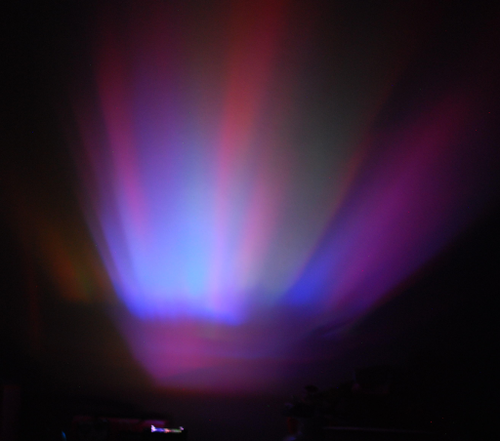
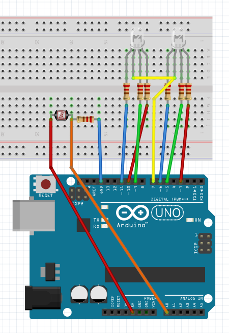
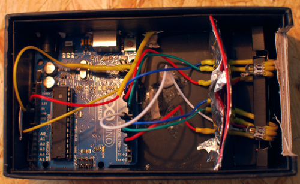
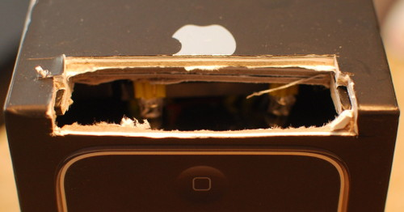

# Aurora lamp based on Arduino

I had this idea in mind for a while, but it took me some time to acually do it.
My child likes when there is some light in the room. I was thinking about 
building something which not only will provide light, but will be pretty and
fun to watch. The other requirement was to make it automatically switch on
when the lights go off. In theory this supposed to take some pressure of
that moment. This part was only my wishful thinking. Here is a picture of the
projection the lamp makes on the wall. It is not as bright, I needed to use
long exposure time.



---

## Parts

* Arduino board
* 2 x RGB LEDs
* 6 x 200 Ohms resistors (I should use a different resistance per each color)
* light sensor
* 10kOhm resistor
* a box (i.e. package for iPhone 3GS)
* piece of plastic - old credit/gift card
* kitchen foil, or anything which will reflect the light
* software - https://github.com/zalun/AuroraLamp



---

## Assembly

There was no need for glue - board and parts fit in the box perfectly.



A window is needed to reflect the light on the wall.



Some decoration made by my daughter made it a usable product.


---

## Tinkering

If you want - just upload the software and all should be fine. But it is 
designed to make some changes.

Lamp switches on when the ambient light level is below the value of `BRIGHT`

```const int BRIGHT = 5;```

Speed of the calculations is defined in `STEP` in milliseconds

```const int STEP = 5;```
